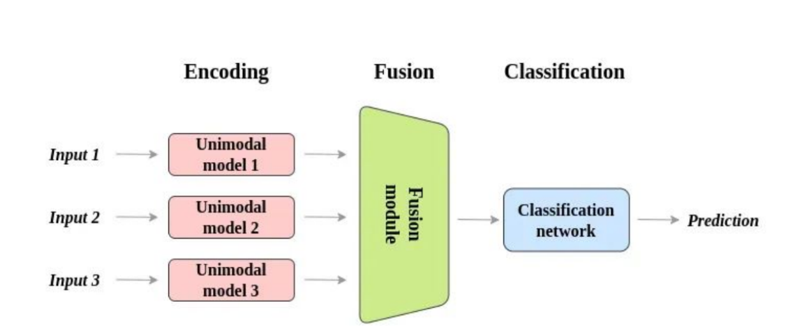
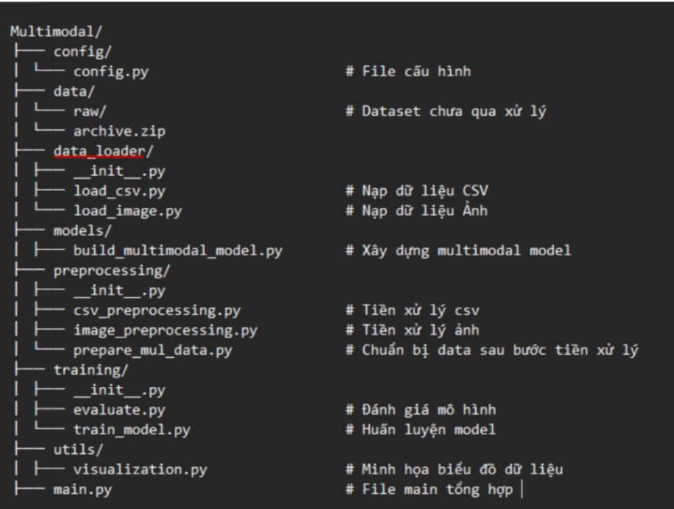
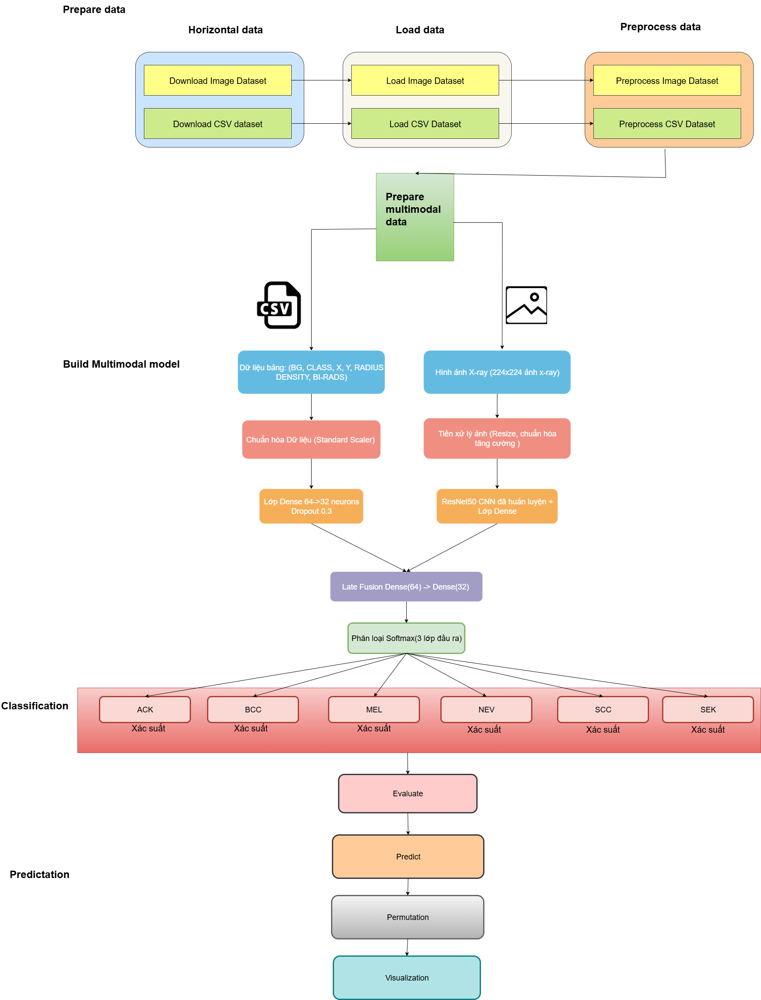
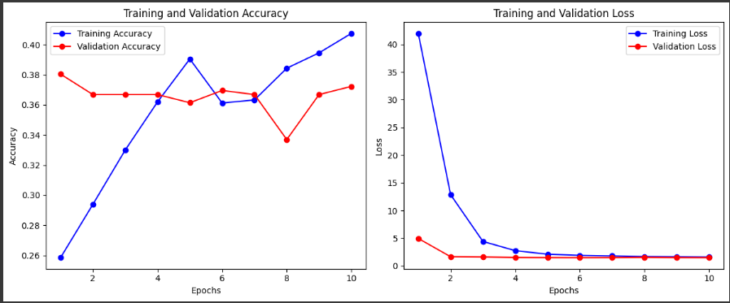
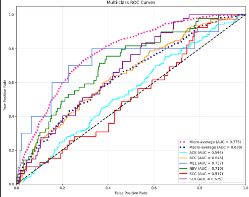
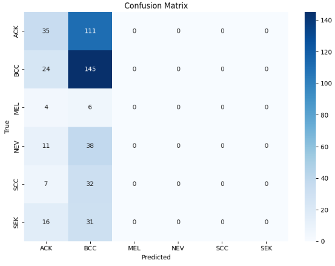
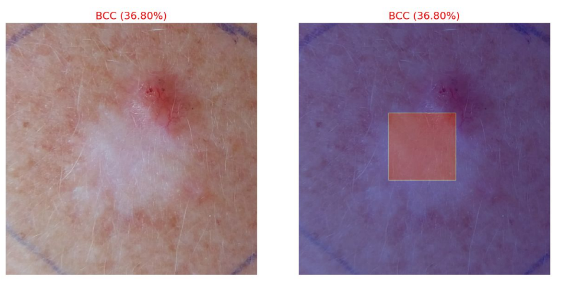

# Ứng dụng mô hình trí tuệ nhân tạo đa thể thức để chẩn đoán bệnh ung thư trong y học

Tên tiếng Anh: Applying multimodal artificial intelligence to cancer diagnosis in medical science

Sinh viên thực hiện:
- Đinh Huỳnh Gia Bảo – 22520101 (MMTT2022.1)
- Trần Gia Bảo – 22520117 (MMTT2022.1)

Cán bộ hướng dẫn: 
- ThS. Nguyễn Khánh Thuật 

Đây là đồ án chuyên ngành (NT114.P21 - VN(ĐA)) với mục đích triển khai một hệ thống trí tuệ nhân tạo đa phương thức (Multimodal AI) cho bài toán chẩn đoán ung thư trong y học.

## Giới thiệu

### Tình hình

- Ung thư là một trong những căn bệnh nguy hiểm nhất và là nguyên nhân gây tử vong hàng đầu trên thế giới. Theo Tổ chức Y tế Thế giới (WHO), đây là nguyên nhân tử vong đứng thứ hai toàn cầu, với khoảng 9,6 triệu ca tử vong vào năm 2018, tương đương cứ 6 người thì có 1 người tử vong vì ung thư. 

- Tình hình ung thư tại Việt Nam đang ở mức báo động với số ca mắc và tử vong không ngừng gia tăng. Theo thống kê của GLOBOCAN (Global Cancer Observatory) năm 2022, Việt Nam ghi nhận 180.480 ca mắc mới và 120.184 ca tử vong do ung thư. Xét về tỷ lệ mắc mới, Việt Nam đứng thứ 20 tại châu Á và xếp thứ 101 trên toàn cầu, cho thấy gánh nặng bệnh tật ngày càng nghiêm trọng.

- Ở nam giới, các loại ung thư phổ biến nhất gồm ung thư phổi, tuyến tiền liệt, đại trực tràng, dạ dày và gan, trong khi ở nữ giới, ung thư vú, đại trực tràng, phổi, cổ tử cung và tuyến giáp là những loại thường gặp nhất. Trong đó, tại Việt Nam hiện nay là, ở nam giới: Ung thư gan chiếm tỷ lệ cao nhất (19,7%), tiếp theo là ung thư phổi (17,7%) và ung thư dạ dày (11%); ở nữ giới: Ung thư vú chiếm tỷ lệ cao nhất (28,9%), ung thư phổi (8,7%) và ung thư đại trực tràng (8,7%).


Tuy nhiên, hệ thống y tế vẫn còn đang gặp nhiều khó khăn trong việc chẩn đoán chính xác do thiếu hụt dữ liệu chất lượng, giới hạn trong chia sẻ thông tin giữa các bệnh viện và sự đa dạng trong triệu chứng của bệnh nhân.

Trong bối cảnh đó, trí tuệ nhân tạo (Artificial Intelligence - AI) đã được ứng dụng rộng rãi trong y học, đặc biệt là để hỗ trợ phát hiện và chẩn đoán ung thư. 

### Multimoda là gì?

- Là một dạng trí tuệ nhân tạo có khả năng xử lý đồng thời nhiều dạng dữ liệu và thực hiện các tác vụ đa phương thức khác nhau, chẳng hạn như hình ảnh, âm thanh và văn bản, …

- Quá trình kết hợp các phương thức này bắt đầu bằng nhiều mô hình đơn phương thức (Unimodal).



## Mục tiêu

- Mục tiêu chính mà chúng em hướng đến đó chính là xây dựng một hệ thống AI có khả năng chẩn đoán bệnh ung thư bằng cách kết hợp học liên kết và trí tuệ nhân tạo đa thể thức nhằm tối ưu hóa quá trình truyền tải dữ liệu giữa các cơ sở y tế. Cụ thể:

    - Phát triển mô hình multimodal AI phân tích ảnh y tế và hồ sơ y tế.
    - Triển khai FL để đào tạo mô hình trên dữ liệu phân tán cơ bản.
    - Đánh giá độ chính xác, hiệu quả truyền dữ liệu của hệ thống.

- Đồ án này tập trung vào các loại ung thư phổ biến như **ung thư vú, ung thư da**, bởi vì đây là những bệnh lý có tỷ lệ mắc cao và có dữ liệu y khoa phong phú để thử nghiệm

## Cài đặt

```bash
pip install -r requirements.txt
```

## Sử dụng

```bash
cd src/
python main.py
```

## Cấu trúc dự án



## Quy trình thực hiện Multimodal



Hệ thống được thiết kế nhằm kết hợp dữ liệu hình ảnh y khoa (ảnh X-ray) và dữ liệu bảng (thông tin lâm sàng định lượng) để cải thiện hiệu quả trong chẩn đoán. Quy trình bao gồm các bước chính như sau:

**1. Chuẩn bị dữ liệu**

- Dữ liệu được thu thập từ hai nguồn chính:

    - Ảnh X-ray (224x224): dùng để biểu diễn trực quan tổn thương.
    
    - Dữ liệu bảng (CSV): bao gồm các đặc trưng như BG, CLASS, X, Y, RADIUS, DENSITY, BI-RADS.

- Sau khi tải về, dữ liệu được phân thành ba giai đoạn xử lý:

    - Tải dữ liệu: Load ảnh và bảng vào hệ thống.

    - Tiền xử lý ảnh: Resize, chuẩn hóa và tăng cường dữ liệu (augmentation).
    
    - Tiền xử lý bảng: Chuẩn hóa dữ liệu bằng Standard Scaler.

- Hai nguồn dữ liệu sau đó được đồng bộ theo từng mẫu để xây dựng bộ dữ liệu đa phương thức.

**2. Xây dựng mô hình đa phương thức**

- Mô hình được chia thành hai nhánh xử lý song song:

    - Nhánh xử lý dữ liệu bảng:

        - Chuẩn hóa dữ liệu bằng StandardScaler.

        - Đưa vào mạng Dense với kiến trúc: Dense(64) → Dense(32), kết hợp Dropout (0.3).

    - Nhánh xử lý dữ liệu ảnh:

        - Dữ liệu ảnh được đưa qua mô hình CNN ResNet50 đã được huấn luyện trước (pre-trained).

        - Sau ResNet50, một lớp Dense được thêm vào để trích xuất đặc trưng.

    - Trộn đặc trưng (Late Fusion):

        - Đặc trưng từ hai nhánh được kết hợp bằng tầng fusion: Dense(64) → Dense(32).

**3. Phân loại**

- Đầu ra là một lớp Softmax phân loại ảnh vào một trong các nhóm tổn thương: ACK, BCC, MEL, NEV, SCC, SEK.

- Kết quả đầu ra là các xác suất tương ứng với từng loại tổn thương.

**4. Đánh giá và trực quan hóa**

- **Đánh giá (Evaluate):** đo lường độ chính xác, độ nhạy, độ đặc hiệu, v.v.

- **Dự đoán (Predict)**: chạy inference với tập dữ liệu chưa biết.

- **Permutation**: thực hiện kiểm định hoán vị để đánh giá độ tin cậy.

- **Trực quan hóa (Visualization)**: biểu diễn kết quả bằng biểu đồ, confusion matrix, hoặc heatmap để hỗ trợ phân tích.

## Kết quả

- Biểu đồ accuracy/loss theo 



- Biểu đồ ROC



- Biểu đồ Confusion Matrix



- Chạy thử đánh giá, chẩn đoán



## Hướng phát triển

- Trong tương lai chúng nhóm có một số dự định được đề ra như sau:

    - Tích hợp thêm nhiều client trong môi trường Federated Learning thực tế, bao gồm nhiều bệnh viện hoặc cơ sở y tế.
    - Tăng kích thước và đa dạng hoá dữ liệu từ nhiều nguồn để cải thiện độ chính xác và khả năng khái quát.
    - Xây dựng giao diện web demo , cho phép người dùng tải ảnh và thông tin cá nhân để nhận kết quả chẩn đoán trực tuyến.
    - Kết hợp các kỹ thuật Explainable AI ,(XAI) để cung cấp lý do đằng sau mỗi chẩn đoán, tăng mức độ tin tưởng.